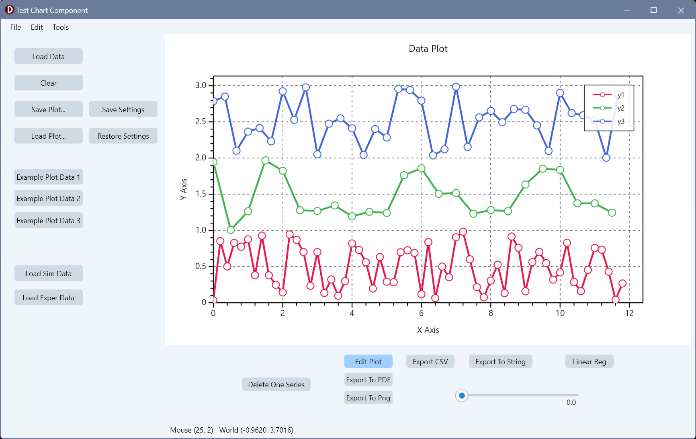
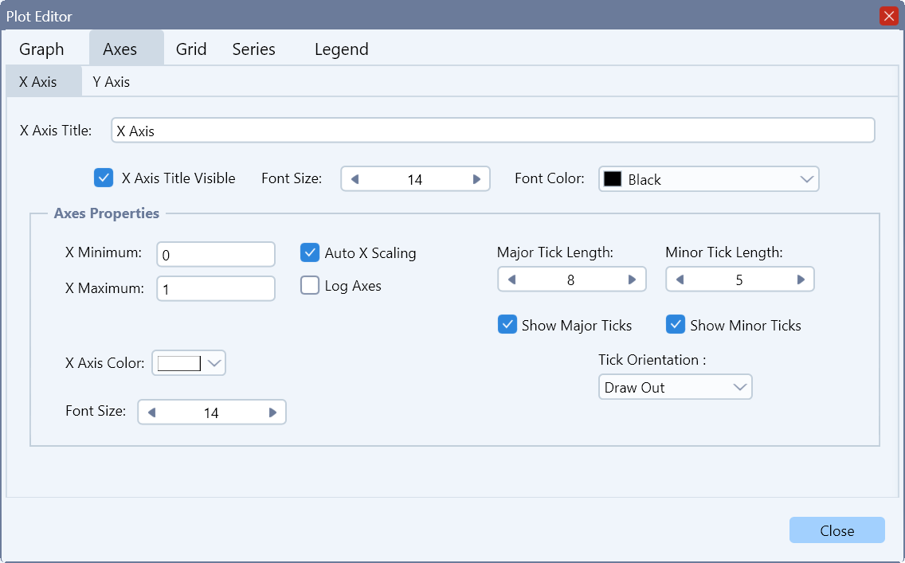

# TSkPlotPaintBox — a Skia-backed 2D plotting component for Delphi FireMonkey

A 2D charting control for RAD Studio **FireMonkey (FMX)**, rendered with the
**Skia** backend. `TSkPlotPaintBox` is a `TSkPaintBox` descendant that draws
line/marker charts with full styling, a draggable legend, log axes, data-anchored
annotations, interactive zoom/pan, point picking, JSON persistence and
PNG/PDF/CSV export.

It ships as a run-time package, a design-time package (component palette
registration) and a demo application.

---

## Contents

- [Installing](#installing)
- [Building](#building)
- [Quick start](#quick-start)
- [Units](#units)
- [Interaction: zoom, pan and picking](#interaction-zoom-pan-and-picking)
- [Annotations (labelling individual points)](#annotations-labelling-individual-points)
- [Series](#series)
- [Styling](#styling)
- [Persistence and the settings store](#persistence-and-the-settings-store)
- [Import / export](#import--export)
- [Precision notes](#precision-notes)

## Screenshots

 &nbsp; 
---

## Installing

1. Install the **Skia4Delphi** packages (`Skia.Package.RTL`, `Skia.Package.FMX`)
   and enable Skia in your project.
2. Build and install **`Package/PlotDesignTimePackage.dproj`** in the IDE — it
   registers `TSkPlotPaintBox` on the `ComponentLibrary` palette page.
   The run-time package must be built first (the group project encodes that order).
3. The run-time property editor form (`ufPlotEditor`) additionally requires the
   external **`LabelTrackBarRuntime`** package, which supplies `TLabelledTrackBar`.
   (`Source/uLabelledTrackBar.pas` is that control's source, kept in-tree for
   reference.)

Any host application must set `GlobalUseSkia := True` before
`Application.Initialize` — see `Demo/TestPlotProject.dpr`.

## Building

Projects:

| Project | Purpose |
| --- | --- |
| `Package/PlotProjectGroup.groupproj` | Everything, in dependency order |
| `Package/PlotRuntimePackage.dproj` | `{$RUNONLY}` — all the code |
| `Package/PlotDesignTimePackage.dproj` | `{$DESIGNONLY}` — palette registration |
| `Demo/TestPlotProject.dproj` | Demo app (Win64) |

Command line (RAD Studio 13 / BDS 37.0):

```cmd
call "C:\Program Files (x86)\Embarcadero\Studio\37.0\bin\rsvars.bat"
msbuild Package\PlotProjectGroup.groupproj /t:Build /p:Config=Debug /p:Platform=Win64
```

> Adding a new source unit requires **two** edits: list it in
> `Package/PlotRuntimePackage.dpk` (`contains`) *and* in
> `PlotRuntimePackage.dproj` (`<DCCReference>`). msbuild reads the `.dproj`,
> the IDE reads the `.dpk`.

## Quick start

```pascal
uses SkPlotPaintBox, uPlotSeries;

// From a CSV file — one series per column after the first (X) column.
Plot.LoadData('linear.csv', True, True, False, False).Free;

// Built by hand.
var ps := TPlotSeries.Create('Fitted', claBlue, False);   // False = no markers
ps.AddXY(x1, y1);
ps.AddXY(x2, y2);
Plot.AddSeries(ps);
Plot.Redraw;
```

`LoadData(FileName, LineVisible, MarkerVisible, ClearSeries, ClearDataKinds)`
returns a `TStringList` whose objects are the created series (free the list, not
the objects). `ClearDataKinds` removes existing `skData` series first, so
reloading measured data doesn't disturb simulation curves.

## Units

| Unit | Contents |
| --- | --- |
| `SkPlotPaintBox.pas` | `TSkPlotPaintBox` and its styling sub-objects (`TAxisLimits`, `TAxisStyle`, `TGridStyle`, `TLegendStyle`, `TTextProperty`), rendering, interaction, export |
| `uPlotSeries.pas` | `TPlotSeries` / `TPlotSeriesList` — one X/Y curve, its styling, and how it draws itself |
| `uPlotAnnotation.pas` | `TPlotAnnotation` / `TPlotAnnotationList` — data-anchored, pixel-offset text labels |
| `uPlotMapper.pas` | `TPlotMapper` — the data↔pixel transform, plus `TPointD` / `TRectD` |
| `uPlotDefaults.pas` | Global `PlotDefaults` record + JSON loader for default series styling |
| `uColorManager.pas` | `TColorManager.NextColor` — cycles a fixed palette |
| `uCSVReaderForPlotter.pas` | CSV parser used by `LoadData` (error bars, `NA` markers) |
| `uPlotJsonUtils.pas` | Small JSON get/put helpers shared by all persistence code |
| `uMathParser.pas` | Expression parser for function-defined series |
| `ufPlotEditor.pas/.fmx` | `TFrmPlotEditor` — run-time tabbed property editor |

## Interaction: zoom, pan and picking

These were added for use as a **bifurcation-diagram** viewer, where you need to
scroll into a fold and read off exact parameter values. They are off by default
so ordinary plots behave as before.

### `ZoomPanEnabled` (default `False`)

Set it to `True` to activate:

| Gesture | Effect |
| --- | --- |
| Mouse wheel | Zoom in/out about the cursor (factor 1.2 per notch) |
| Left-drag | Pan — the data grabbed at press stays under the cursor |
| **Shift** + left-drag | Rubber-band box zoom (trackpad friendly); a box under 5 px is ignored |
| Double-click | `ResetZoom` — back to autoscale |

`ResetZoom` can also be called directly, and is safe when no zoom is active.
Setting `ZoomPanEnabled := False` also clears any active view window.

**How it works.** Zoom and pan write an explicit view window (in data
coordinates) that `RenderChart` uses *verbatim* — bypassing autoscale, manual
`AxisLimits` and the usual 5 % padding, so deep zoom keeps its precision. All
the math is done in **pixel space** and unmapped through the mapper, which means
log axes come out right for free. Pan and box zoom each snapshot the mapper at
press time, so a drag is exact and drift-free.

### `OnPointPicked` and `PickTolerance`

```pascal
property OnPointPicked: TOnPointPicked;   // (Sender; Series; Index; DataX, DataY: Double)
property PickTolerance: Single;           // pixel radius, default 8
```

Fires on a left-click that lands within `PickTolerance` pixels of a **stored
data point**, and hands back that point's exact double value — e.g. a fold's
`B = 24.384900179508524` — rather than the cursor's world position, which is
what the older `OnReportCoordinates` reports. `FindNearestPoint` does the search
in pixel space over visible series and skips NaN pen-lift separators.

Picking and panning coexist: with `ZoomPanEnabled` on, a left press is only a
*pan candidate* until it moves more than 3 px. A press that stays under that
threshold is treated as a click and fires `OnPointPicked` on mouse-up.

### `OnReportCoordinates`

Still available: fires on mouse move with the cursor position in both screen and
world coordinates. Suppressed while panning or dragging the legend.

### Other mouse behaviour

- The legend is **draggable**; `ResetLegendPosition` puts it back on its anchor.
- Right-click opens a context menu: copy image to clipboard, export PDF, export PNG.

## Annotations (labelling individual points)

`TPlotAnnotation` is a text label **anchored in data coordinates but offset in
screen pixels**, so it stays glued to its point through resize and rescale with a
constant visual gap. This is the `LP1` / `H1` / `BP2` convention used by AUTO,
XPPAUT, MatCont and PyDSTool.

```pascal
var a := Plot.AddAnnotation('LP1', bx, by);   // returns the annotation for tuning
a.OffsetX           := 8;
a.OffsetY           := -10;
a.Align             := aaBottomLeft;
a.BackgroundVisible := True;      // for legibility over a curve
a.LeaderVisible     := True;      // thin line back to the anchor point
Plot.Redraw;

Plot.ClearAnnotations;
```

- Collection: `Plot.Annotations` (`TPlotAnnotationList`) — owns and frees them.
- Properties: `Text`, `Anchor`, `OffsetX/Y`, 9-way `Align` (`aaTopLeft`…`aaBottomRight`),
  `FontSize`, `FontColor`, optional background (`BackgroundVisible/Color`,
  `Padding`), optional border (`BorderVisible/Color/Width`), optional leader line
  (`LeaderVisible/Color/Width`), and `Visible`.
- An annotation is **not** a series: it never contributes to autoscale and never
  appears in the legend. Drawn on top of the series, under the legend.
- Full JSON persistence, saved with the rest of the plot.

## Series

`TPlotSeries` holds `Data: TList<TPointD>` — **double precision** — plus line and
marker styling, and knows how to draw itself given a `TPlotMapper`.

```pascal
ps := TPlotSeries.Create('branch', claRed, True);
ps.AddXY(x, y);
ps.AddXY(x, y, SourceRowIndex);          // tagged overload
idx := ps.SourceTag(PointIndex);         // -1 if that point wasn't tagged
```

Behaviours worth knowing:

- **NaN is a pen lift.** A point with a NaN coordinate breaks the polyline
  (matplotlib/gnuplot convention), so one series can hold several disconnected
  runs — e.g. the stable and unstable segments of a branch. Autoscale
  (`CalculateDataBounds`) ignores NaN points too, so they never poison the range.
- **Single-point series still render their marker.** The draw guard is
  `Count < 1`, not `Count < 2`, so a lone special point (a fold, a Hopf point) is
  a perfectly good one-point series with markers on and the line off.
- **`ShowInLegend`** keeps a curve on the chart but out of the legend,
  independently of `Visible`. Used to collapse several runs of one branch —
  all sharing a name and style — down to a single legend entry.
- **`SeriesKind`** (`skSimulation` / `skData`) and **`SeriesId`** classify a
  series; `ClearSeriesKind(skData)` removes all of one kind. `Tag` is a free-form
  integer for the host; the component never interprets it.
- **`SourceTags`** are a sparse back-reference from a plotted point to the row it
  came from — populated only by the tagged `AddXY` overload, keyed by point index.
- Markers: `symPoint`, `symSquare`, `symCircle`, `symCross`, `symTimes`,
  `symDiamond`, `symTriangle`. Line styles: `ltSolid`, `ltDashDash`, `ltDotDot`.

Series management on the control: `AddSeries`, `ClearSeries`, `ClearSeriesKind`,
`Series.Find(Name, Index)`.

## Styling

Published sub-objects, each a `TPersistent` with an `OnChange` that the control
wires to a repaint:

- **`AxisLimits`** — manual `MinX/MaxX/MinY/MaxY` (used when `AutoXScaling` /
  `AutoYScaling` are off).
- **`AxisStyle`** — `LogX`/`LogY`, per-axis major/minor tick visibility and
  length, and tick drawing direction (`tmOut`, `tmIn`, `tmBoth`).
- **`GridStyle`** — per-axis major/minor visibility, colour, width and division
  counts.
- **`LegendStyle`** — visibility, border, background colour and opacity, and
  anchor `Location` (`llTopRight`, `llTopLeft`, `llBottomRight`, `llBottomLeft`).
- **`ChartTitle` / `XAxisTitle` / `YAxisTitle`** (`TTextProperty`: text,
  visibility, colour, font size), plus `XAxisFontSize` / `YAxisFontSize`.
- Plot area: `PlotAreaColor`, `PlotBorderColor/Width/Visible`, `BackGroundColor`,
  `OriginOnAxis`.

When adding a styling property, follow the existing setter → `Changed` → redraw
pattern.

### Default series styling

`uPlotDefaults` holds a global `PlotDefaults` record read by `TPlotSeries.Create`.
Point `Plot.DefaultsFile` at a JSON file (or call `ReloadDefaults`) **before**
adding series:

```json
{
  "series": {
    "lineWidth": 2.0,
    "lineStyle": "Solid",
    "markerSize": 6.0,
    "markerShape": "Circle",
    "markerStrokeWidth": 1.5,
    "markerFillColor": "#FFFFFFFF"
  }
}
```

All keys are optional; missing keys keep the built-in value.

`TColorManager.NextColor` cycles a fixed palette so successive series get
distinct colours; `TColorManager.ResetCycle` restarts it.

## Persistence and the settings store

**Whole plot to/from a file** — every styling sub-object plus all series and
their data points:

```pascal
Plot.SavePlotToFile('plot.json');
Plot.LoadPlotFromFile('plot.json');   // replaces series, overwrites settings
```

Keys absent from the file keep their current value, so older and newer files load
gracefully.

**In-memory styling snapshots** — styling only, *no* data points, keyed by string.
Typical use is one key per analysis, so switching analyses and coming back
restores the styling the user last set:

```pascal
Plot.SaveSettings('bifurcation');
if not Plot.RestoreSettings('bifurcation') then ... ;   // False if key unknown
Plot.HasSettings(Key);
Plot.DeleteSettings(Key);
Plot.ClearAllSettings;
Plot.SettingsKeys;      // TArray<string>
```

Per-series styling in a snapshot is matched back up by series **Name**. The
component owns every snapshot and frees them on destroy — callers only ever pass
keys.

## Import / export

```pascal
Plot.ExportToPng('chart.png', 4.0);        // scale factor
Plot.ExportToPdf('chart.pdf');
Plot.ExportCSV('all.csv', True);           // SharedXColumn
Plot.ExportCSVSeries('outdir');            // one file per series
S := Plot.ExportCSVSeriesAsString(5, 12);  // decimals, min column width
```

The CSV reader behind `LoadData` supports an error-bar extension
(`value [+e,-e]`) and `NA` missing-data markers.

## Precision notes

The data model is `Double` end to end — `TPointD`, `TPlotMapper.DataRect`,
`TAxisLimits`, the zoom/pan view window, and the accumulators in
`CalculateDataBounds`. Only pixel space is `Single` (`PixelRect` and the draw-call
coordinates), because the Skia canvas API is `Single`.

Keep it that way: a stray `Single` anywhere in the bounds or mapping path
re-truncates the values and breaks deep zoom.
