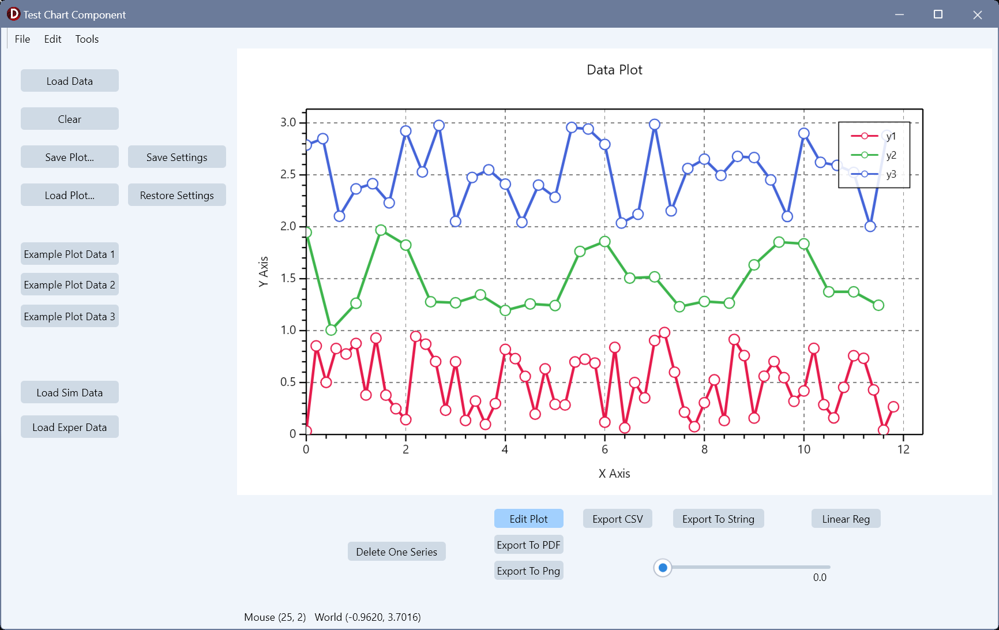
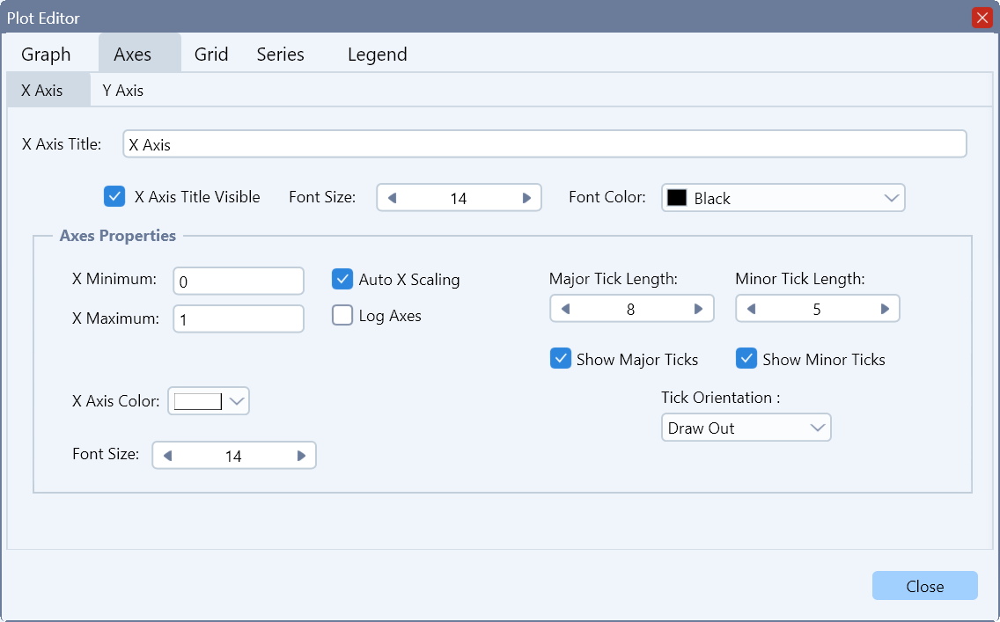

# TSkPlotPaintBox — a Skia-backed 2D plotting component for Delphi FireMonkey

A 2D charting control for RAD Studio **FireMonkey (FMX)**, rendered with the
**Skia** backend. `TSkPlotPaintBox` is a `TSkPaintBox` descendant that draws
line/marker charts with full styling, a draggable legend, log axes, data-anchored
annotations, interactive zoom/pan, point picking, JSON persistence and
PNG/PDF/CSV export.

It ships as a run-time package, a design-time package (component palette
registration) and a demo application.

This code was developed using a combination of Human effort and AI assistance.

---

## Contents

- [Installing](#installing)
- [Building](#building)
- [Quick start](#quick-start)
- [Units](#units)
- [Interaction: zoom, pan and picking](#interaction-zoom-pan-and-picking)
- [Annotations (labelling individual points)](#annotations-labelling-individual-points)
- [Series](#series)
- [Styling](#styling)
- [Persistence and the settings store](#persistence-and-the-settings-store)
- [Import / export](#import--export)
- [Precision notes](#precision-notes)

## Screenshots

 &nbsp; 
---

## Installing

1. Install the **Skia4Delphi** packages (`Skia.Package.RTL`, `Skia.Package.FMX`)
   and enable Skia in your project.
2. Build and install **`Package/PlotDesignTimePackage.dproj`** in the IDE — it
   registers `TSkPlotPaintBox` on the `ComponentLibrary` palette page.
   The run-time package must be built first (the group project encodes that order).
3. The run-time property editor form (`ufPlotEditor`) additionally requires the
   external **`LabelTrackBarRuntime`** package, which supplies `TLabelledTrackBar`.
   (`Source/uLabelledTrackBar.pas` is that control's source, kept in-tree for
   reference.)

Any host application must set `GlobalUseSkia := True` before
`Application.Initialize` — see `Demo/TestPlotProject.dpr`.

## Building

Projects:

| Project | Purpose |
| --- | --- |
| `Package/PlotProjectGroup.groupproj` | Everything, in dependency order |
| `Package/PlotRuntimePackage.dproj` | `{$RUNONLY}` — all the code |
| `Package/PlotDesignTimePackage.dproj` | `{$DESIGNONLY}` — palette registration |
| `Demo/TestPlotProject.dproj` | Demo app (Win64) |

Command line (RAD Studio 13 / BDS 37.0):

```cmd
call "C:\Program Files (x86)\Embarcadero\Studio\37.0\bin\rsvars.bat"
msbuild Package\PlotProjectGroup.groupproj /t:Build /p:Config=Debug /p:Platform=Win64
```

> Adding a new source unit requires **two** edits: list it in
> `Package/PlotRuntimePackage.dpk` (`contains`) *and* in
> `PlotRuntimePackage.dproj` (`<DCCReference>`). msbuild reads the `.dproj`,
> the IDE reads the `.dpk`.

## Quick start

```pascal
uses SkPlotPaintBox, uPlotSeries;

// From a CSV file — one series per column after the first (X) column.
Plot.LoadData('linear.csv', True, True, False, False).Free;

// Built by hand.
var ps := TPlotSeries.Create('Fitted', claBlue, False);   // False = no markers
ps.AddXY(x1, y1);
ps.AddXY(x2, y2);
Plot.AddSeries(ps);
Plot.Redraw;
```

`LoadData(FileName, LineVisible, MarkerVisible, ClearSeries, ClearDataKinds)`
returns a `TStringList` whose objects are the created series (free the list, not
the objects). `ClearDataKinds` removes existing `skData` series first, so
reloading measured data doesn't disturb simulation curves.

## Units

| Unit | Contents |
| --- | --- |
| `SkPlotPaintBox.pas` | `TSkPlotPaintBox` and its styling sub-objects (`TAxisLimits`, `TAxisStyle`, `TGridStyle`, `TLegendStyle`, `TTextProperty`), rendering, interaction, export |
| `uPlotSeries.pas` | `TPlotSeries` / `TPlotSeriesList` — one X/Y curve, its styling, and how it draws itself |
| `uPlotAnnotation.pas` | `TPlotAnnotation` / `TPlotAnnotationList` — data-anchored, pixel-offset text labels |
| `uPlotMapper.pas` | `TPlotMapper` — the data↔pixel transform, plus `TPointD` / `TRectD` |
| `uPlotDefaults.pas` | Global `PlotDefaults` record + JSON loader for default series styling |
| `uColorManager.pas` | `TColorManager.NextColor` — cycles a fixed palette |
| `uCSVReaderForPlotter.pas` | CSV parser used by `LoadData` (error bars, `NA` markers) |
| `uPlotJsonUtils.pas` | Small JSON get/put helpers shared by all persistence code |
| `uMathParser.pas` | Expression parser for function-defined series |
| `ufPlotEditor.pas/.fmx` | `TFrmPlotEditor` — run-time tabbed property editor |

## Interaction: zoom, pan and picking

These were added for use as a **bifurcation-diagram** viewer, where you need to
scroll into a fold and read off exact parameter values. They are off by default
so ordinary plots behave as before.

### `ZoomPanEnabled` (default `False`)

Set it to `True` to activate:

| Gesture | Effect |
| --- | --- |
| Mouse wheel | Zoom in/out about the cursor (factor 1.2 per notch) |
| Left-drag | Pan — the data grabbed at press stays under the cursor |
| **Shift** + left-drag | Rubber-band box zoom (trackpad friendly); a box under 5 px is ignored |
| **Ctrl** + double-click | `ResetZoom` — back to autoscale |

A plain double-click opens the run-time property editor instead, and does so
whether or not `ZoomPanEnabled` is set — see below.

`ResetZoom` can also be called directly, and is safe when no zoom is active.
Setting `ZoomPanEnabled := False` also clears any active view window.

**How it works.** Zoom and pan write an explicit view window (in data
coordinates) that `RenderChart` uses *verbatim* — bypassing autoscale, manual
`AxisLimits` and the usual 5 % padding, so deep zoom keeps its precision. All
the math is done in **pixel space** and unmapped through the mapper, which means
log axes come out right for free. Pan and box zoom each snapshot the mapper at
press time, so a drag is exact and drift-free.

### Double-click: the run-time property editor

A plain (unmodified) double-click on the chart opens `TFrmPlotEditor`
(`ufPlotEditor`), the tabbed dialog for editing chart, axis, series and legend
properties while the app is running. The form is created on first use and shown
non-modally, then the chart is redrawn.

This is independent of `ZoomPanEnabled` — it works on any plot. Hold **Ctrl**
while double-clicking to reset the zoom instead (that half does require
`ZoomPanEnabled`).

> **Behaviour change.** A plain double-click used to call `ResetZoom`. That has
> moved to **Ctrl+double-click**, freeing the unmodified double-click for the
> property editor. Code calling `ResetZoom` directly is unaffected; only the
> gesture changed.

### `OnPointPicked` and `PickTolerance`

```pascal
property OnPointPicked: TOnPointPicked;   // (Sender; Series; Index; DataX, DataY: Double)
property PickTolerance: Single;           // pixel radius, default 8
```

Fires on a left-click that lands within `PickTolerance` pixels of a **stored
data point**, and hands back that point's exact double value — e.g. a fold's
`B = 24.384900179508524` — rather than the cursor's world position, which is
what the older `OnReportCoordinates` reports. `FindNearestPoint` does the search
in pixel space over visible series and skips NaN pen-lift separators.

Picking and panning coexist: with `ZoomPanEnabled` on, a left press is only a
*pan candidate* until it moves more than 3 px. A press that stays under that
threshold is treated as a click and fires `OnPointPicked` on mouse-up.

### `OnReportCoordinates`

Still available: fires on mouse move with the cursor position in both screen and
world coordinates. Suppressed while panning or dragging the legend.

### Clicking the legend to show/hide a series

With `LegendStyle.ClickToToggle` (default `True`), clicking a legend entry flips
that series' `Visible` flag — the standard way to declutter a busy chart.

For this to work in both directions, a hidden series **keeps its legend row**
rather than disappearing from the box; the row is drawn at
`LegendStyle.DimmedOpacity` (default `0.35`) so it reads as "off" while staying
clickable.

#### `ShowInLegend` vs `Visible`

`ShowInLegend := False` still removes a series from the legend outright — no
row, no dimmed placeholder, nothing to click. It is the outer test, so it wins
regardless of `Visible` or `ClickToToggle`:

| `ShowInLegend` | `Visible` | Result |
| --- | --- | --- |
| `True`  | `True`  | Listed normally, drawn on the chart |
| `True`  | `False` | Listed **dimmed** — clickable to switch back on — not drawn |
| `False` | `True`  | Not listed at all, drawn on the chart |
| `False` | `False` | Not listed at all, not drawn |

> **Behaviour change.** Before click-to-toggle, `Visible := False` on its own
> also dropped the series from the legend. That is now row 2 — the dimmed row is
> the whole point of the feature. Code that relied on the old side effect should
> set `ShowInLegend := False` instead, or turn `ClickToToggle` off for that plot.

Toggling does **not** rescale the axes: autoscale bounds are computed over all
series, visible or not, so the curves that remain stay exactly where they were.

Clicking and dragging coexist the same way picking and panning do — a press on
the legend is a *drag candidate* until it moves more than 3 px; under that it is
a click and toggles the entry on mouse-up. Set `ClickToToggle := False` to get
the old behaviour back (legend lists visible series only, clicks do nothing).

### Other mouse behaviour

- The legend is **draggable**; `ResetLegendPosition` puts it back on its anchor.
- Right-click opens a context menu: copy image to clipboard, export PDF, export PNG.

## Annotations (labelling individual points)

`TPlotAnnotation` is a text label **anchored in data coordinates but offset in
screen pixels**, so it stays glued to its point through resize and rescale with a
constant visual gap. This is the `LP1` / `H1` / `BP2` convention used by AUTO,
XPPAUT, MatCont and PyDSTool.

```pascal
var a := Plot.AddAnnotation('LP1', bx, by);   // returns the annotation for tuning
a.OffsetX           := 8;
a.OffsetY           := -10;
a.Align             := aaBottomLeft;
a.BackgroundVisible := True;      // for legibility over a curve
a.LeaderVisible     := True;      // thin line back to the anchor point
Plot.Redraw;

Plot.ClearAnnotations;
```

- Collection: `Plot.Annotations` (`TPlotAnnotationList`) — owns and frees them.
- Properties: `Text`, `Anchor`, `OffsetX/Y`, 9-way `Align` (`aaTopLeft`…`aaBottomRight`),
  `FontSize`, `FontColor`, optional background (`BackgroundVisible/Color`,
  `Padding`), optional border (`BorderVisible/Color/Width`), optional leader line
  (`LeaderVisible/Color/Width`), and `Visible`.
- An annotation is **not** a series: it never contributes to autoscale and never
  appears in the legend. Drawn on top of the series, under the legend.
- Full JSON persistence, saved with the rest of the plot.

## Series

`TPlotSeries` holds `Data: TList<TPointD>` — **double precision** — plus line and
marker styling, and knows how to draw itself given a `TPlotMapper`.

```pascal
ps := TPlotSeries.Create('branch', claRed, True);
ps.AddXY(x, y);
ps.AddXY(x, y, SourceRowIndex);          // tagged overload
idx := ps.SourceTag(PointIndex);         // -1 if that point wasn't tagged
```

Behaviours worth knowing:

- **NaN is a pen lift.** A point with a NaN coordinate breaks the polyline
  (matplotlib/gnuplot convention), so one series can hold several disconnected
  runs — e.g. the stable and unstable segments of a branch. Autoscale
  (`CalculateDataBounds`) ignores NaN points too, so they never poison the range.
- **Single-point series still render their marker.** The draw guard is
  `Count < 1`, not `Count < 2`, so a lone special point (a fold, a Hopf point) is
  a perfectly good one-point series with markers on and the line off.
- **`ShowInLegend`** keeps a curve on the chart but out of the legend,
  independently of `Visible`. Used to collapse several runs of one branch —
  all sharing a name and style — down to a single legend entry.
- **`SeriesKind`** (`skSimulation` / `skData`) and **`SeriesId`** classify a
  series; `ClearSeriesKind(skData)` removes all of one kind. `Tag` is a free-form
  integer for the host; the component never interprets it.
- **`SourceTags`** are a sparse back-reference from a plotted point to the row it
  came from — populated only by the tagged `AddXY` overload, keyed by point index.
- Markers: `symPoint`, `symSquare`, `symCircle`, `symCross`, `symTimes`,
  `symDiamond`, `symTriangle`. Line styles: `ltSolid`, `ltDashDash`, `ltDotDot`.

Series management on the control: `AddSeries`, `ClearSeries`, `ClearSeriesKind`,
`Series.Find(Name, Index)`.

### Drop lines (residual / stem plots)

Switching on `DropLinesVisible` draws a vertical line from **every** point in the
series down to a baseline — the conventional way to present residuals. It is a
whole-series setting; there is deliberately no per-point control.

```pascal
ps := TPlotSeries.Create('residuals', claRed, True);
ps.LineVisible      := False;      // markers + stems, no connecting curve
ps.DropLinesVisible := True;
Plot.AddSeries(ps);
```

| Property | Default | Meaning |
| --- | --- | --- |
| `DropLinesVisible` | `False` | Off, so existing plots are unaffected |
| `DropLineColor` | series colour | Stem colour |
| `DropLineWidth` | `PlotDefaults.LineWidth` | Stem width |
| `DropLineStyle` | `ltSolid` | `ltSolid`, `ltDashDash` or `ltDotDot` |
| `DropLineBaseline` | `0.0` | Where the stems land, in **data** coordinates |

Notes:

- `DropLineBaseline` is a data value, not a pixel position — `0.0` is the zero
  line a residual plot wants. Set it elsewhere to stem from a different level.
  The baseline does not have to be inside the view; stems are clipped to the
  plot area like everything else.
- On a **log Y axis** a baseline of zero or less has no representation, so the
  stems fall to the foot of the plot area instead.
- Stems are drawn **before** the curve and markers, so those land on top, and
  they honour the same skip rules — a NaN pen-lift or a log-excluded point gets
  no stem, just as it gets no marker.
- Dashed stems restart their pattern on each stem rather than running
  continuously through the series.
- The settings are cloned and persisted with the rest of the series styling.

### Y error bars

Error magnitudes are attached **per point**; `ErrorBarsVisible` is the
whole-series switch that draws them. Points without an error simply get no bar,
so a series can carry errors on some points only.

```pascal
ps.SetYError(Index, E);                  // symmetric
ps.SetYError(Index, EMinus, EPlus);      // asymmetric: below, above
ps.ErrorBarsVisible := True;
```

| Property | Default | Meaning |
| --- | --- | --- |
| `ErrorBarsVisible` | `False` | Whole-series switch |
| `ErrorBarColor` | series colour | Bar and cap colour |
| `ErrorBarWidth` | `1.0` | Stroke width |
| `ErrorBarCapSize` | `6.0` | **Total** cap width in pixels; `0` draws a bare bar |
| `ErrorBarDirection` | `ebdBoth` | `ebdBoth`, `ebdUp` or `ebdDown` |

Supporting calls: `TryGetYError(Index, Minus, Plus)`, `HasYError(Index)`,
`ClearYError(Index)`, `ClearYErrors`, `YErrorCount`.

Notes:

- **Magnitudes, not offsets.** Signs are ignored (`Abs` is applied when
  drawing), so a signed `-0.2` straight from a CSV gives the same bar as `0.2`.
- **`ebdUp` / `ebdDown` draw one arm only** — for an error meaningful in a
  single direction, such as a detection limit or a one-sided bound.
- **Bars are included in autoscale**, so an arm is never clipped by the plot
  edge — but only when `ErrorBarsVisible` is on, and only in the direction(s)
  actually drawn. A one-sided bar doesn't widen the range at the other end.
- On a **log Y axis**, an arm at or below zero has no representation, so it is
  pinned to the foot of the plot area and excluded from the autoscale minimum.
- Bars are drawn under the curve and markers, so the point stays legible on top
  of its bar, and they honour the same NaN / log skip rules.
- Errors are **data, not styling**: they travel with `SaveToJson` /
  `LoadFromJson` (a sparse `yErrors` array of `[index, minus, plus]` triples)
  and are deep-copied by `Clone`. The styling snapshot used by
  `SaveSettings` / `RestoreSettings` carries the five properties above but no
  magnitudes. A plot file written before error bars existed has no `yErrors`
  key and loads with none.

#### Loading error bars from CSV

`LoadData` reads the CSV error-bar extension straight into the series, and
switches `ErrorBarsVisible` on for any column that carried one — a file that
bothered to record errors expects to see them. Clear the flag on the returned
series if you'd rather not.

```
"Time", "Conc"
1, 10[0.5]              symmetric: ±0.5
2, 20 [+0.1,-0.3]       asymmetric: 0.1 above, 0.3 below
3, 30                   no error
```

Only **Y** errors are picked up. An error in the first column would be an X
error, which the series doesn't model yet, so it is ignored.

How the two bracketed values map onto the arms:

- **If the signs disagree**, they decide: `[+0.1,-0.3]` and `[-0.3,+0.1]` both
  give 0.1 above and 0.3 below. This is worth stating because the parser stores
  the *first* bracketed value in `.lower` and the second in `.upper`, which is
  the opposite way round from the `[+e,-e]` convention in its own header
  comment. Reading the signs sidesteps the naming entirely.
- **If they don't** (`[0.7,0.2]`), there is no hint to go on, so position
  decides: first value below the point, second above.
- A single value (`[0.5]`) is symmetric.

## Styling

Published sub-objects, each a `TPersistent` with an `OnChange` that the control
wires to a repaint:

- **`AxisLimits`** — manual `MinX/MaxX/MinY/MaxY` (used when `AutoXScaling` /
  `AutoYScaling` are off).
- **`AxisStyle`** — `LogX`/`LogY`, per-axis major/minor tick visibility and
  length, and tick drawing direction (`tmOut`, `tmIn`, `tmBoth`).
- **`GridStyle`** — per-axis major/minor visibility, colour, width and division
  counts.
- **`LegendStyle`** — visibility, border, background colour and opacity, anchor
  `Location` (`llTopRight`, `llTopLeft`, `llBottomRight`, `llBottomLeft`), and
  `ClickToToggle` / `DimmedOpacity` for click-to-show/hide.
- **`ChartTitle` / `XAxisTitle` / `YAxisTitle`** (`TTextProperty`: text,
  visibility, colour, font size), plus `XAxisFontSize` / `YAxisFontSize`.
- Plot area: `PlotAreaColor`, `PlotBorderColor/Width/Visible`, `BackGroundColor`,
  `OriginOnAxis`.

When adding a styling property, follow the existing setter → `Changed` → redraw
pattern.

### Default series styling

`uPlotDefaults` holds a global `PlotDefaults` record read by `TPlotSeries.Create`.
Point `Plot.DefaultsFile` at a JSON file (or call `ReloadDefaults`) **before**
adding series:

```json
{
  "series": {
    "lineWidth": 2.0,
    "lineStyle": "Solid",
    "markerSize": 6.0,
    "markerShape": "Circle",
    "markerStrokeWidth": 1.5,
    "markerFillColor": "#FFFFFFFF"
  }
}
```

All keys are optional; missing keys keep the built-in value.

`TColorManager.NextColor` cycles a fixed palette so successive series get
distinct colours; `TColorManager.ResetCycle` restarts it.

## Persistence and the settings store

**Whole plot to/from a file** — every styling sub-object plus all series and
their data points:

```pascal
Plot.SavePlotToFile('plot.json');
Plot.LoadPlotFromFile('plot.json');   // replaces series, overwrites settings
```

Keys absent from the file keep their current value, so older and newer files load
gracefully.

**In-memory styling snapshots** — styling only, *no* data points, keyed by string.
Typical use is one key per analysis, so switching analyses and coming back
restores the styling the user last set:

```pascal
Plot.SaveSettings('bifurcation');
if not Plot.RestoreSettings('bifurcation') then ... ;   // False if key unknown
Plot.HasSettings(Key);
Plot.DeleteSettings(Key);
Plot.ClearAllSettings;
Plot.SettingsKeys;      // TArray<string>
```

Per-series styling in a snapshot is matched back up by series **Name**. The
component owns every snapshot and frees them on destroy — callers only ever pass
keys.

## Import / export

```pascal
Plot.ExportToPng('chart.png', 4.0);        // scale factor
Plot.ExportToPdf('chart.pdf');
Plot.ExportCSV('all.csv', True);           // SharedXColumn
Plot.ExportCSVSeries('outdir');            // one file per series
S := Plot.ExportCSVSeriesAsString(5, 12);  // decimals, min column width
```

The CSV reader behind `LoadData` supports an error-bar extension
(`value [+e,-e]`) and `NA` missing-data markers. Error terms are loaded into the
series as Y error bars — see [Y error bars](#y-error-bars).

> The reader ends rows on **CR**, so input files need CRLF (or CR) line
> endings; an LF-only file fails with "Too many datum points on line: 1".

## Precision notes

The data model is `Double` end to end — `TPointD`, `TPlotMapper.DataRect`,
`TAxisLimits`, the zoom/pan view window, and the accumulators in
`CalculateDataBounds`. Only pixel space is `Single` (`PixelRect` and the draw-call
coordinates), because the Skia canvas API is `Single`.

Keep it that way: a stray `Single` anywhere in the bounds or mapping path
re-truncates the values and breaks deep zoom.
